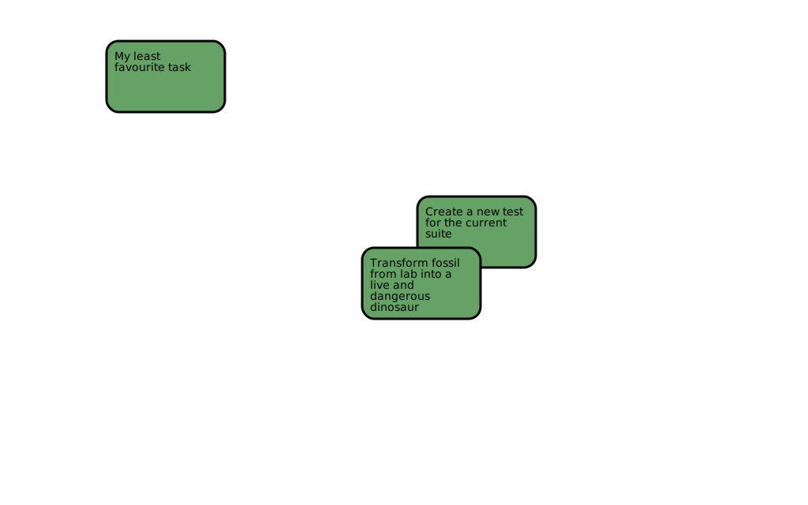

PERT
====

Visualize a list of tasks as a PERT chart. Effectively, is a way less powerful
view of the one you can get from MS Project's PERT chart.


## Quickstart guide

```python
import pert

project = pert.Project()
project.addTask(pert.Task(id="12", title="Create a new test for the current suite"))
project.addTask(pert.Task(id="keyword-001", title="My least favourite task"))
project.addTask(
    pert.Task( id="1", title="Transform fossil from lab into a live and dangerous dinosaur")
)

svg = pert.SVG.fromProject(project)
svg.arrange(pert.Arrangement.Random)
svg.save("/tmp/file.svg")
```

And as of now (after ~6h of development) this is the output you can get:


So yes, it is missing arrows, actual box boundaries to avoid overlapping,
showing the id of the task somewhere, and many many other features...
**But right now you can see green boxes!**

## Contributing

First, install the required packets in a virtualenv

```bash
virtualenv .venv
source .venv/bin/activate
pip install -r requirements.txt
```

And then, run the tests with

```bash
python -m pytest
```
